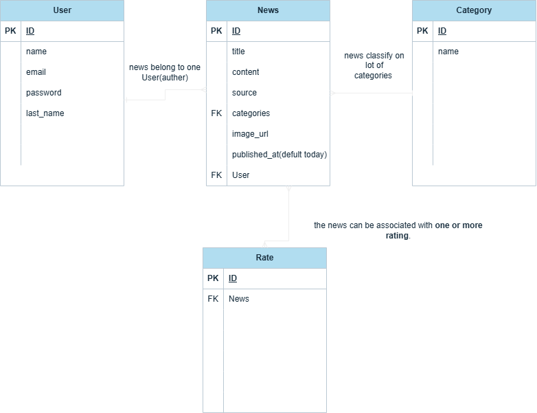
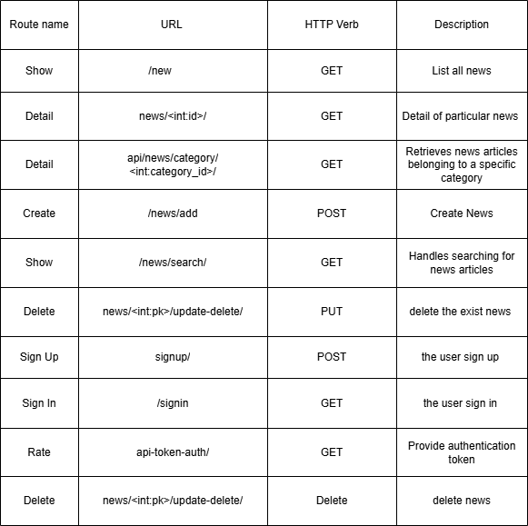

# Web News React Project:
### News project  that users can browse articles  manage there News and interact with other news. 

## Technologies i've Used:
* **Django**  high-level Python web framework that encourages rapid development and clean, pragmatic design. Built by experienced developers, it takes care of much of the hassle of web development, so you can focus on writing your app without needing to reinvent the wheel. It’s free and open source.
* **Python:** Python is an interpreted, object-oriented, high-level programming language with dynamic semantics. Its high-level built in data structures, combined with dynamic typing and dynamic binding.
* **postgreSQL:** PostgreSQL is a powerful, open source object-relational database system that uses and extends the SQL language combined with many features that safely store and scale the most complicated data workloads
* **django restframework :** used to create HTTP requests to external resources. In React. js, using Axios allows you to make HTTP requests to*
* **Postman:**  API platform for building and working with APIs. It takes the pain out of every stage of the API lifecycle—from designing and testing to delivery and monitoring. Built for teams, Postman makes it easy to collaborate, stay organized, and build secure, reliable APIs faster.
* **GIT:** free and open source distributed version control system designed to handle everything from small to very large projects with speed and efficiency.

## ERD diagram:

## Route 

## Installation Instructions:
### git clone https://git.generalassemb.ly/AhmedHomroon/news-backend.git
### cd news-backend
### cd NewsCollector 
### run pip install requirements.txt
### make sure run py manage.py makemigrations to your DB
### run py manage.py migrate
### run py manage.py runserver 

## IceBox:
* **add notifications**
* **user can log in with google email**
* **user prefer News**
* **make website more scalable**

